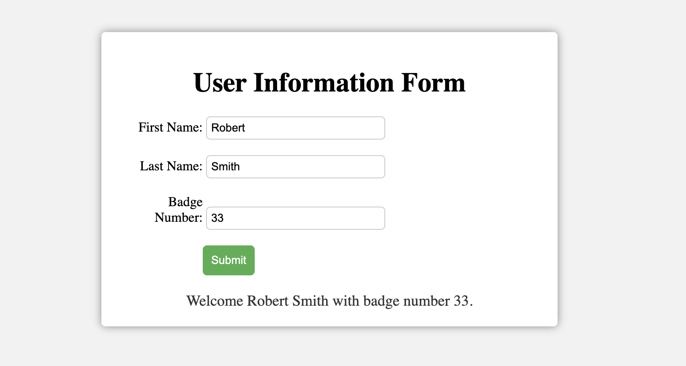

This project is a simple web form that collects user information and displays it on the screen. The form collects the user's first name, last name, and badge number. The form then concatenates the first and last names and displays the concatenated name along with the badge number on the screen.

## Getting Started
To run this project, you'll need a web browser and a text editor. Follow these steps:
Download the project files to your computer.
Open the index.html file in a web browser.
Fill in the form with your first name, last name, and badge number.
Click the submit button.

## Implementation

The program is implemented using HTML, CSS, and JavaScript. The HTML file contains a form with input fields for the user's first name, last name, and badge number. There's also a submit button and an empty div where the concatenated name and badge number will be displayed.

The CSS file contains styles for the form and the output div to make the page look more presentable.

The JavaScript file contains a function called processUserInput that gets the input elements and the output element using their ids. The function adds an event listener to the submit button using the addEventListener method. The click event triggers the callback function that performs the required operations.

Inside the callback function, the JavaScript code gets the values from the input elements, concatenates the first and last names, and validates the length of the concatenated name and the badge number. If any of the input values are invalid, the program displays an alert message and returns without displaying the concatenated name and badge number. If all input values are valid, the program displays the concatenated name and badge number in the output div using template literals.

## Conclusion
This project demonstrates how to collect user information from a web form and display it on the screen using JavaScript. It also shows how to validate user input and prevent the program from continuing until all requirements are met. This project can be easily modified to collect other types of information and perform other types of validation.

## LICENSE
**Open to Experiment**

BY:ROBERT SMITH

CREDIT: University of Advancing Technology

EMAIL - Robertsdev8@gmail.com.com for Colloboration 